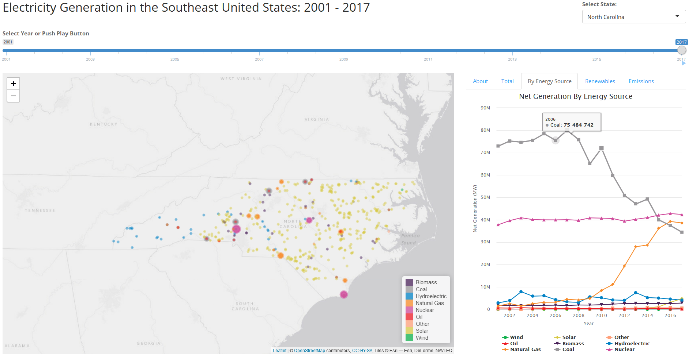
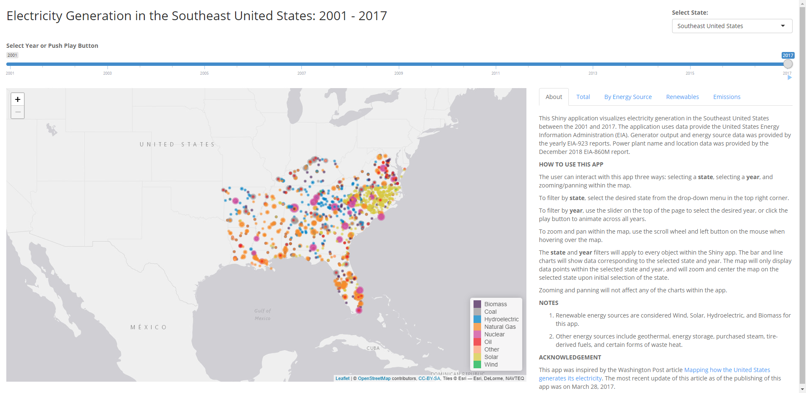
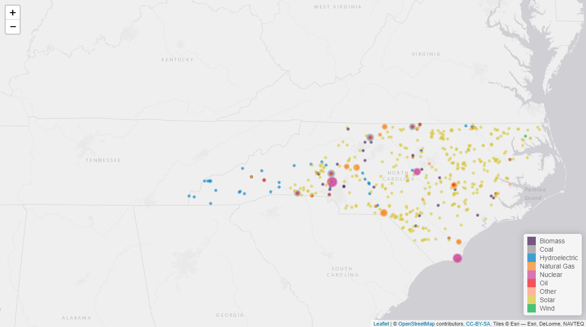
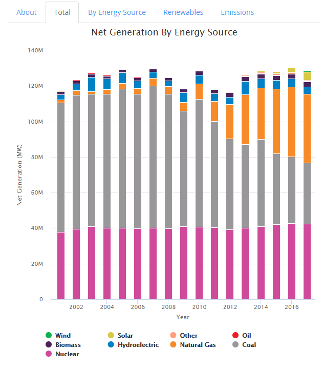
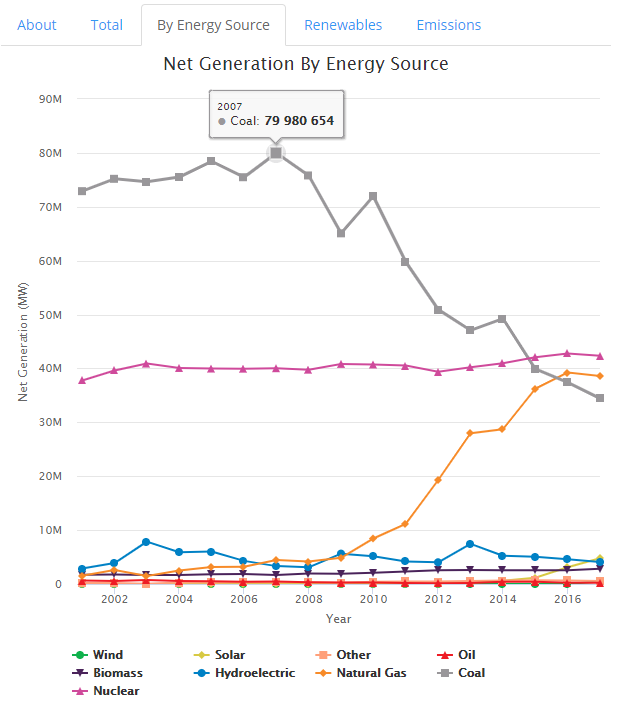
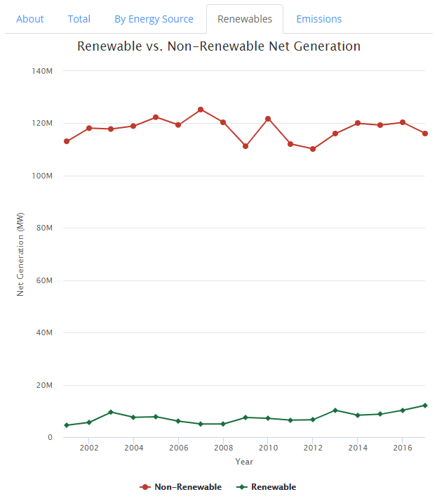
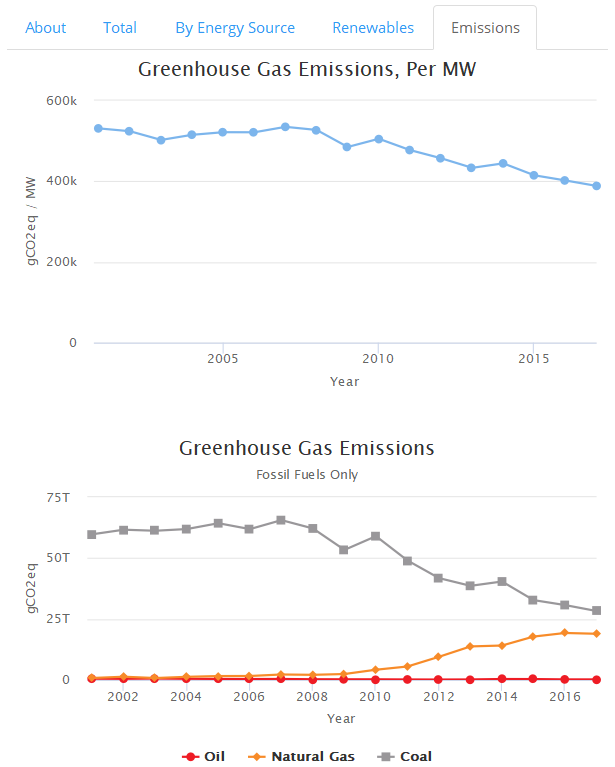
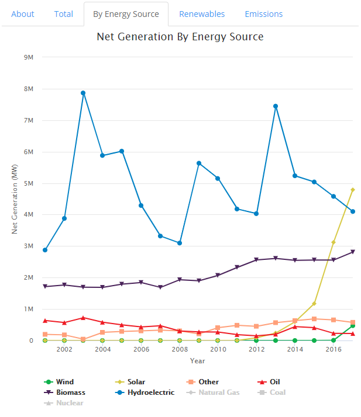

# Electricity Generation In the Southeast United States Between 2001 and 2017

https://evan-canfield.shinyapps.io/Southeast_US_Electricity/

## About the App

This Shiny app was created as a Final Project for DSBA 5122: Visual Analytics at University of North Carolina Charlotte. It was inspired by the visualizations in the Washington Post article [Mapping how the United States generates its electricity](https://www.washingtonpost.com/graphics/national/power-plants).

This app visualizes electricity generation in the Southeast United States between the 2001 and 2017. The application uses data provide the United States Energy Information Administration (EIA). Generator output and energy source data was provided by the yearly EIA-923 reports. Power plant name and location data was provided by the December 2018 EIA-860M report.

The app opens on two side-by-side components, a Leaflet map centered on the Southeast United States, and a selection of tab panels, of which the tab that opens upon loading is the tab describing the app. The other tab panels contain of charts created with Highcharter.

## Leaflet Map

On the map are individual points made up of CircleMarkers. Each point represents the generation of a specific type of energy from a single power plant. If a plant generates power from multiple types of energy (i.e.: coal and natural gas), there will be as many points as energy types at that location. Each point is color coded to the nine energy types designated for this app. 

There are two inputs that impact the visuals in this app: year, and state. 

* The year is selected via a slider at the top of the page. The slider animates so the user could press and see the visual progress from 2001 to 2017 in one year increments. 

* The state is selected from a drop-down menu at found at the top right corner. An individual state can be selected, or all Southeast states can be selected.

The app is already filtered for the 2017 data and the entire Southeast United States upon loading. Selecting a year or a state will filter every visual, both map and charts. Additionally selecting a state will zoom and center the map on that state. As the map input is filtered by that state selection, only the power plants in that state are generated. For example, selecting North Carolina and 2017 yields the following map.

## Highcharter Charts

There are four five tabs on the left hand side of the app. One tab is dedicated to information gegarding the operation of the app. The remaining contain charts generated using Highcharter. The following are brief descriptions of each chart.

### Tab: Total

This tab contains a stacked bar chart. The size of each bar indicated the total electricity generated that year. The color within the bar chart indicates the portion of that generation attributed to each energy source. 

### Tab: By Energy Source

This tab contains a line graph. Each line is the net generated electricity for a specific energy type.

### Tab: Renewables

This tab contains a line graph. One line represented the electricity generated by non-renewable energy sources, the other by renewable (definied as Wind, Solar, Hydroelectric, and Biomass in this app).

 

### Tab: Emissions

This tab contains two line graphs. The top is the total greenhouse gas emissions per electrical generation. The bottom is the total greenhouse gas emissions for the three fossil fuel types.

Greenhouse gas emissions are estimataed based on the 2014 International Panel of Climate Change Fifth Assessment Report (AR5), Annex III.

#### A note on filtering the charts

Highcharter allows for filtering directly on the chart. Selecting one of the legend item will remove that legend item from the chart. The chart axis will then re-adjust to fill the a page. Selecting the legend item again re-instates the item. This filter DOES NOT affect the map. Ideally, a future iteration of this app would filter by energy types consistentnly across the map and charts. 

For example, see the two charts below. Both charts is based on the same *state* and *year* inputs selected, North Carolina, 2017 (as was the By Energy Source tab picture above). Only in the image on the right Coal, Natural Gas, and Nuclear have been filtered from the chart. The remaining energy sources, previously relegated to look more-or-less like a line running along the bottom of the chart, now fill the screen. Actual change and trends in electricity generation from these energy sources can be observed.

 

