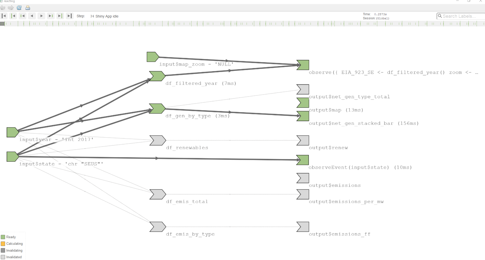
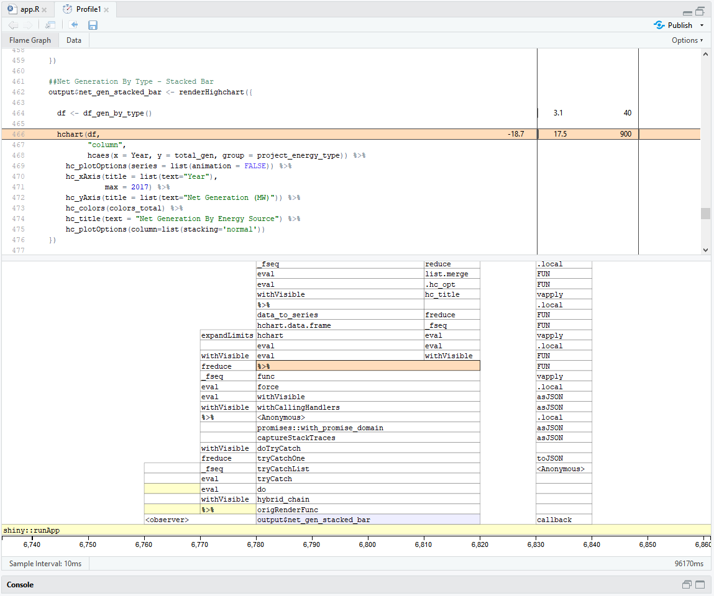

``````{r setup, include=FALSE}

knitr::opts_chunk$set(echo = TRUE)

if (!require(prettydoc)) {install.packages('prettydoc')} 
library(prettydoc)

if (!require(kableExtra)) {install.packages('kableExtra')} 
library(kableExtra)
```


#Introduction {#section1}

From the early part of the last decade, total electricity generation has remained relatively steady in the United States. What has changed is the manner in which it is generated. Renewable energy sources for electricity generation such as solar, wind, and hydroelectric through the use of photovoltaics and turbines technologies, have increased in use accounting for over 16% on a national level. Alternatively, generation from nuclear sources and fossil fuels such as coal, natural gas, and oil continue to dominate the power landscape. In the United States, coal was the major source power, accounting for over half the total of electricity generation at the start of the century, according to the U.S. Energy Information Administration (EIA). Since then, coal use has dropped dramatically to just under 30% of the total generation. Due to advances of fracking, which in turn have unlocked resources from shale deposits all around the country, natural gas has taken its place as the leader in the U.S. at 32%.

In the Southeast region of the United States, the changes in electricity generation between renewable and fossil fuels/nuclear sources have not kept pace with the rest of the country. By the end of 2017, renewable energy sources account for just over 6% of the region’s electricity, which is just a slight increase from 2001. While the region as a whole continues to rely heavily on fossil and nuclear sources, each state within the Southeast tells a different story. 

In our Shiny application using 2001 to 2017 data provided by the EIA, we attempt to illustrate how electricity generation has changed over time for each state in the Southeast United States. Specifically, we illustrate changes by renewable and non-renewable energy sources as well as the various resource types. Furthermore, we supplement these visuals by showing carbon over the same time period.

#Data/Operation Abstraction Design {#section2}
##Data Preparation {#section2.1}

The primary data used for this Shiny application is publicly available data provided by the US Energy Information Administration (EIA) in the form of year EIA-923 reports, or equivalent (see Reference 7.1). Before 2006 the relevant data was reported in reports EIA-906/920 or EIA-906, which are consistent with EIA-923. The reports provide detailed electric power data on electricity generation, fuel consumption, fossil fuel stocks, and receipts at the power plant and prime mover level. This app was only concerned with electricity generation on a yearly basis and was restricted to the Schedule 1 survey data, or equivalent. The reports are available in spreadsheet form from 2001 through 2018, although the 2018 data is not used. See [Appendix, Section 1](#appsection1) for more detail.

The most current issue of report EIA-860M was also used (December 2018 as of app development, see Reference 7.2). This report provided generator-specific information for all generators and associated environmental equipment at electric power plants with 1 megawatt or greater of combined nameplate capacity. This report provided context for the EIA-923 information, including energy type, location, and plant name, and other essential information. Location data is comprised of longitude and latitude coordinates, as well as city and state information. 

The raw data from EIA-923 reports, or equivalent, and EIA-860 were compiled, merged, and joined initially through a SAS Enterprise Guide process. The output of the SAS process was then further refined in R, until all of the necessary information was contained within a single, tidy dataframe. Each observation within the dataframe was an energy type (see descriptions in [Section 2.2](#section2.2)) at an operating plant for a given year, with all relevant yearly data such as net electricity generation or net greenhouse gas emissions. If multiple energy types were present at the same location then that location would have as many operations as energy types, with each energy type reporting output data. For example, Plant.ID_Energy (see [Section 2.2](#section2.2)) values of 10_COL and 10_NG indicate coal generation and natural gas generation at Plant ID 10. Both of these observations have the same location data, but different fuel type, generation, and emission data.

Further processing of the dataframe was then performed within the Shiny app, although outside the ui and server. This processing created eight additional dataframes, each specific to a Shiny application component. Creating these specific dataframes was done to reduce processing within the server during operation to the absolute minimum.  

See [Appendix, Section 1](#appsection1), for detailed discussion of the data processing performed in R.

##Dataset Variables {#section2.2}

The complete dataset, before further app specific processing, contained the following twelve variables:

```{r echo = FALSE}
table_section_2.2 <- read.csv(file = "./data/Table_Section2.2.csv")

kable(table_section_2.2) %>%
  kable_styling(bootstrap_options = c("striped", "hover", "condensed", "responsive"), 
                                      full_width = FALSE, position = "left")

```


#Encoding/Interaction Design {#section3}

In our design, we utilized a map of the extended Southeast region of the United States as the main visualization which serves as the initial focal point. This map was generated with Leaflet. The states included are Alabama, Arkansas, Florida, Georgia, Kentucky, Louisiana, Mississippi, North and South Carolina, Tennessee, and Virginia. A point was placed on the map for each unique Power.ID_Energy code (see [Section 2.2](#section2.2)) for the year selected. Each point represents the electricity generation by a specific energy source type at a power plant. The points are located on the map by their latitude and longitude coordinates. The size of the point is in relation to the effective rate of the plant (see [Section 2.2](#section2.2)), and the color illustrates the energy source type. 

Upon the initial load of the visualization, the map shows data for the most recent year, 2017. The selected year filters all of the data within the application, so that all app components, map and charts, are showing data from the selected year. Located at the top of the page is a slider for selecting the year, and on the right side of the slider action button. When activated the year changes, as indicated by the time line at the top of the page, to the beginning of the data set. This action at first shows data for 2001 and automatically progresses to each following year. This in turn, simultaneously filters the app by the selected year, and animates the regional map and charts to show the yearly changes for each plot.

To supplement the main map visualization five charts were generated using Highcharts and were broken out across four-tab panels. Below is a description of the charts:

*	Tab Panel: Total
    + Stacked bar chart: The bar height indicates the total electricity generation for the given year, with the color sections indicating the electricity generated for a specific energy type.

*	Tab Panel: By Energy Source

    +	Line chart: The line indicates the total electricity generation for the specific energy type for a given year.

*	Tab Panel: Renewables.

    +	Line chart: The line indicates the total electricity generation for either renewable or non-renewable energy for a given year.

*	Tab Panel: Renewables

    +	Line chart: The line indicates total greenhouse emissions per generated electricity (MW) for a given year.

    +	Line chart: The line indicates total greenhouse emissions for fossil fuel.

An additional tab panel, About, contains information on how to use the app.

Like the main visualization, the same color codes used in the map are utilized to differentiate the various energy sources for each of supplemental charts. To focus on a particular data element, a user can interact by selecting/deselecting a type on the chart legend, such as Coal or Renewables.

To drill down and focus on an individual state within the Southeast region, we placed a pull-down menu located at the top right side and above the dashboard. By utilizing the pull-down menu, a user can choose a state and filter the data and visualization. Once selected, the map zooms in to that state while the supplemental visuals show filtered values. Like the regional map, the action button can be used to animate and display the year to year changes of electricity generation for an individual state.


#Algorithic Design {#section4}

There are two major components to this app, the map visualization utilizing Leaflet, and five charts spread over four separate tab panels. Each component required special consideration for algorithmic design.

##Leaflet Map

The Leaflet map, visualizing all of the power generating location in the Southeast United States, is the only component that is permanently on the screen while the app is in operation. This component is also processing the largest amount of input data in the app, when compared to the charts. Therefore, proper design is essential for the map to run smoothly. The primary method for this is to break up the Leaflet visual into different components. The first component is called outside of the server and the ui and performs the initial render the Leaflet map.

```{r eval=F, echo=T}
map <- leaflet('map',
               options = leafletOptions(minZoom = 5, preferCanvas = TRUE),
               sizingPolicy = leafletSizingPolicy(padding = "10px")) %>%
  addTiles() %>%
  addProviderTiles(providers$Esri.WorldGrayCanvas,
                   options =  providerTileOptions(updateWhenZooming = FALSE,
                                                  updateWhenIdle = TRUE )) %>%
  setView(lng = -83.977937,
          lat = 32.190283,
          zoom = 5) %>%
  setMaxBounds(lng1 = -105,
               lat1 = 40,
               lng2 = -75,
               lat2 = 24) %>%
  addLegend(position = "bottomright",
            colors = color_palette$color_code,
            labels = color_palette$project_energy_type,
            opacity = 0.75)
```

This initial component does not call the points to represent each power plant, though. The points are called by a separate component, inside the server. The function leafletproxy() is used as opposed to leaflet(), nested in an observe() call. This prevents the Leaflet map from being fully rendered after every change. Only the dynamic aspects of the map are affected, and only when an action is observed. 

```{r eval=F, echo=T}
    observe({ 
      leafletProxy(mapId = 'map',
                 data = EIA_923_SE) %>% 
      clearMarkers() %>%
      addCircleMarkers(lng = ~Longitude,
                       lat = ~Latitude,  
                       color = ~pal(project_energy_type), 
                       fill = ~pal(project_energy_type),
                       fillOpacity = 0.85,
                       radius = ~radius,
                       label =  ~paste(Plant.Name," - ", Effective_Rate, "MW"), 
                       labelOptions = labelOptions(direction = "bottom",
                                                  style = list(
                                                    "font-family" = "sans-serif",
                                                    "font-style" = "bold",
                                                    "box-shadow" = "3px 3px rgba(0,0,0,0.25)",
                                                    "font-size" = "13px",
                                                    "border-color" = "rgba(0,0,0,0.5)")
                                                  )
                   )
            })
```

Additionally, options were set in order to limit how often and when the Leaflet map would refresh. These options further reduced the computational load of the map, without noticeably degrading the operation of the map for the user.

##Charts

The primary method for maximizing algorithmic capability for the charts is to maximize data processing to outside of the server and ui before passing the required dataframe into the server. As discussed in [Section 2](#section2), the raw data was processed into a single tidy dataset before import into the shiny app. From this master dataset, eight unique datasets were developed. Each of these datasets was processed for a specific use in one or two charts. These specific datasets were imported into the server as reactive values. The only processing taking place in the server is filtering via year and/or state. If the full processing of the dataset occurred in the server, this would encompass many additional actions, including a join. As the app is scaled up, those actions, particularly the joins, could be computationally costly.

A benefit of having the charts broken out onto separate tabs is that only the charts visible to the user are active. See the screenshot below of the reactlog record of the operation of the app, with Total tab selected. There are two reactive expression expressions active, one grabbing the dataframe to input into the map (observe({ EIA_923_SE…}), and the other grabbing the dataframe input into the visible chart on the Total tab (output$net_gen_stacked_bar). The reactive expressions used for input into the charts not visible are not active.

```{r reactlog, echo = FALSE, fig.align = "center", fig.cap="Reactlog Screenshot - Stacked Bar Chart", out.width="75%"}

```

As an additional note, the stacked bar chart was the slowest output within the app, based on the profvis analysis. A select screenshot of the profvis test is found in [Appendix, Section 3](#appsection3).

#User Evaluation {#section5}

An evaluation is an opportunity for a developer to collect feedback from its end users. This in turn allows the developer to understand the visual’s usefulness, if it meets expectations, and most of all, if it provides invaluable insight. 

To evaluate this app we would need to assess several criteria, such as functionality, effectiveness, efficiency, usability, and usefulness. This evaluation can be summarized into two major components. First is the interaction and use of the app. This generally covers functionality, usability, and efficiency. Interaction and use of the app could be evaluated through surveying a variety of users, both new and experienced users to Shiny and the subject matter. After the users have engaged with the app, we would ask how comfortable they felt interacting with the site, how intuitive the controls of the site were, and if they would provide any suggestions on improvements. 

The second component the evaluation would need to assess is if the app provided additional value. If so, is that value beyond what is currently available? This would cover effectiveness and usefulness.  Since this data exists only in raw spreadsheets, and given that there is not a widely available interactive visualization of the data, it is clear that the app does provide some form of additional value

But the question is, can the user correctly understand what the app is conveying? To evaluate this, we propose developing a set of questions and scenarios about the subject matter. We would ask users these questions and asses the responses in both clarity and accuracy. If all the user can do is recite a few raw data points then the app is valid, but perhaps not entirely useful. But if the user can create a story with context, trends, relationships, along with appropriate data points, then the app would be both valid and useful. 

Here are several questions we could ask:

*	Since the mid-2000’s there has been a boom in natural gas production in the Unites States. Has that seemed to have any effect on the use of natural gas to generate electricity since that time?

*	To what extent have renewable energy sources developed in the Southeast United States? Where has the most development been? Least?

*	In the Southeast United States, what was the dominate form of energy in 2001? In 2017? For individual states, how does this compare to the region?


#Future Work {#section6}

Moving forward we would hope to improve and expand the functionality of the app. The following are several areas we would like to pursue:

* Expand the app to include the entire United States. This would make a large increase in the size of the dataset, particularly the number of points on the Leaflet map. Further planning would be required to implement that and not affect the speed and responsiveness of the app.

* Filter by energy type. Which ever form the filter takes it should apply to both the map and any charts. Currently you can filter directly on the charts via the legend, but that filter does not communicate with the map, and the filter resets whenever a new state or new year is selected.

* Be able to select multiple states and/or regions. States do not pursue energy policy in a vacuum. It would be useful to see information on a collection of states, such as North and South Carolina, in addition to individual states.

* Include a visual comparison to average metrics within the United States. This would be useful for seeing how a state compares to the rest of the country, and how the state is, or is not, changing. As a way of implementation perhaps an additional line graph or area chart representing total average generation. This visual could then be placed on top or behind the stacked bar chart on the Total tab, which shows total electrical generation the Southeast or a specific state. The additional visual could add context.


#References {#section7}

7.1.  EIA-923, Annual Power Plant Operations Report, Energy Information Administration, 2001 - 2017 {#ref7.1}

7.2.  EIA-860M, Electric Generator Report, Energy Information Administration, December, 2018

7.3.  International Panel of Climate Change Fifth Assessment Report (AR5), Annex III, 2014

7.4.  Comparison of Life-cycle Greenhouse Gas Emissions of Various Electricity Generation Sources, World Nuclear Association, July 2011

#Appendix

###Library / Options
The following libraries and options were required for processes performed in this appendix. 
```{r message = FALSE}
#Libraries
if (!require(tidyverse)) {install.packages('tidyverse')} 
library(tidyverse)

if (!require(sp)) {install.packages('sp')} 
library(sp)

if (!require(tigris)) {install.packages('tigris')} 
library(tigris)

if (!require(knitr)) {install.packages('knitr')} 
library(knitr)

if (!require(kableExtra)) {install.packages('kableExtra')} 
library(kableExtra)

#Options
options(tigris_use_cache = TRUE)
```


##Section 1: Processing EIA-923 and EIA-860 Data {#appsection1}
###Inputs
The SAS data processing generated the files **EIA-923_Generation_and_Fuel_Data_Summary_2001_2018.csv** and **EIA_860M_COMPILED_LOCATION.csv**. File **energy_conversion_EIA-923.csv** lists every fuel type code from report EIA-923, along with energy type code and name defined by this project (see [Section 2.2](#section2.2).) and whether or not the fuel would be considered Renewable or Non-Renewable. File **carbon_emission_factors.csv** contains the conversion factors for converting the type of energy source to average carbon dioxide (CO~2~) emission (see [Section 2.2](#section2.2)).
```{r}
#EIA-923
EIA_923 <- read.csv("./data/EIA-923_Generation_and_Fuel_Data_Summary_2001_2018.csv", stringsAsFactors = FALSE)

#EIA-860M
EIA_860M <- read.csv("./data/EIA_860M_COMPILED_LOCATION.csv", stringsAsFactors = FALSE)

#Project Definined Conversion Table for Defining Energy Types
EIA_923_energy_conv <- read.csv("./data/energy_conversion_EIA-923.csv", stringsAsFactors = FALSE)

#CO2 Emission Rates
EIA_923_emission <- read.csv("./data/carbon_emission_factors.csv", stringsAsFactors = FALSE)

#Color Palette
color_palette <- read.csv("./data/color_palette.csv", stringsAsFactors = FALSE)
```

###Cleaning and Consolidation

Plant Id and Entity Id were imported as integers, but function as unique identifiers for each plant and utility. Therefore, they are converted to characters for ease of use.
```{r}
## EIA-923
EIA_923$Plant.Id <- as.character(EIA_923$Plant.Id)

## EIA-860M
EIA_860M$Plant.Id <- as.character(EIA_860M$Plant.Id)
EIA_860M$Entity.Id <- as.character(EIA_860M$Entity.Id)
```

EIA_860M contained duplicate rows from the SAS processing step that must be removed. Rows with duplicate information were also removed. 

```{r}
EIA_860M <- EIA_860M %>% 
  select(-County, -State) %>% 
  distinct()
```

The column in EIA_860M for which state each plant was located had missing values. This information is essential for this application. Therefore,the state information for each plant was generated by matching longitude and latitude information to spatial shape files.

```{r}
EIA_860M_SP <- EIA_860M %>% 
  select(Longitude, Latitude)

df <- SpatialPoints(coords = EIA_860M_SP)

US <- states(cb = TRUE)

proj4string(df) <- proj4string(US)

df.over <- over(df, US)

EIA_860M_SP$State_SF <-df.over$STUSPS

EIA_860M$State_SF <- EIA_860M_SP$State_SF
```

The column for the net generation of megawatts in EIA-923 was renamed.
```{r}
EIA_923 <- EIA_923 %>% 
  rename(net_gen_mw = Net.Generation.Megawatthours.,
         Year = YEAR)
```

Dataframe EIA_923 is joined to EIA_860M and EIA_923_energy_conv, first by fuel code for EIA_923_energy_conv, then by Plant Id for EIA_860M. 
```{r}
EIA_923_860M_total <- EIA_923 %>% 
  left_join(y = EIA_923_energy_conv, by = c("ReportedFuel.Type.Code" = "EIA.923_reported_fuel_code")) %>% 
  left_join(y = EIA_860M, by = "Plant.Id") %>% 
  select(-ReportedFuel.Type.Code)
```

The following filtering processes were then performed on the joined dataset. 

* Rows with Plant ID 99999 were removed from the dataset. This plant ID was a code used for energy generated with no known plant to attribute it to. 
* Plants with net generation less than zero were removed.
* Plants with missing longitude and latitude information was filtered out of the dataset. 
```{r}
EIA_923_860M_1 <- EIA_923_860M_total %>% 
  filter(Plant.Id != "99999") %>% 
  filter(net_gen_mw > 0) %>% 
  drop_na()
```

###Processing

A new code was created for each observation that combined the Plant Id and the energy type. Each row would have a unique new code for each year the plant operated.
```{r}
#Create new observation code combining plant ID and energy type
EIA_923_860M_3 <- EIA_923_860M_1 %>% 
  mutate(Plant.ID_Energy = paste(Plant.Id, "_", project_energy_code)) %>% 
  select(Plant.Id, Plant.ID_Energy, Plant.Name, Entity.Id, Entity.Name, net_gen_mw,
         project_energy_code, project_energy_type, renewable, State_SF, Latitude, 
         Longitude, everything())
```

Currently, the dataset lists each generator at each plant an observation. This analysis is only concerned with the total output of each energy type at each plant. Therefore, generators of the same energy type at the same plant are summed together. 

For example, a hydroelectric plant might consist of 5 turbines. These turbines are generators, and therefore for each year operation, the hydroelectric plant would have 5 separate observations. This process sums the net generated electricity for each turbine into a single observation.
```{r}
#Calculate sum of generation for each plant at each year for the same energy type
EIA_923_860M_summary <- EIA_923_860M_3 %>%
  group_by(Plant.ID_Energy, Year) %>% 
  summarise(net_gen_mw = sum(as.numeric(net_gen_mw)))

#Join summed generation with plant information
EIA_923_860M_4 <- EIA_923_860M_3 %>% 
  select(-net_gen_mw) %>% 
  distinct() %>% 
  left_join(EIA_923_860M_summary, by = c("Plant.ID_Energy", "Year"))
```

Each generator at a plant has a rated nameplate generation capacity. This is the amount of electricity generated over an hour from each generator when operating at 100% efficiency. Report EIA-860M provides the nameplate rating for each generator. A plant's nameplate generation rate is simply the sum of the generator's at each plant. For example, McGuire Nuclear Station, just outside of Charlotte, NC, has two generators, each with a nameplate rating of 1158MW, giving the plant an nameplate rating of 2136 MW. 

No plant operates, or is designed to operate, at 100% efficiency. But certain energy sources are expected to operate at much higher or lower rates than others. The percentage of power generated in comparison to nameplate rating is known as the capacity factor. Nuclear plants generally have capacity factor in the 90% range. Hydroelectric plants usually operate at less than 50%, and can range greatly. 

For this Shiny application, to better represent the actual output of each plant, an effective generation rate is calculated. The effective rate is average electricity generated per hour over the course of the applicable year. The effective generation rate will be used as opposed to the available nameplate rating.
```{r}
#Added Effective Generation Rate (MW)
EIA_923_860M_5 <- EIA_923_860M_4 %>% 
  mutate(Effective_Rate = round(net_gen_mw/(365*24), digits = 0))
```

The average CO~2~ emissions for each plant were calculated. See [Section 2.2](#section2.2) for more information.
```{r}
#Add CO2 Emission Factor and CO2 Generated
emission_join <- EIA_923_emission %>% 
  select(-source)

#Calculate gCO2 Generated 
EIA_923_860M_6 <- EIA_923_860M_5 %>% 
  left_join(y = emission_join, by = "project_energy_code") %>% 
  mutate(emission_output = net_gen_mw*1000*emission_factor)
```

The variables were rearranged to a logical order, unnecessary variables were removed from the dataset. The following filtering steps were taken.

* Plants with an effective rate of less than 1 were removed from the dataset.
* Observations from the year 2018 were removed. The number of plants reported this year was approximately half of 2017, which generation remained steady. There appeared to be a change in reporting methodology. Therefore, to maintain a consistent dataset, observations from the year 2018 were removed.
```{r}
#Arrange
EIA_923_860M_7 <- EIA_923_860M_6 %>% 
  select(Plant.ID_Energy, Plant.Name,  project_energy_code, project_energy_type, renewable, net_gen_mw, emission_output, 
         Effective_Rate, State_SF, Latitude, Longitude, Year) %>% 
  arrange(Plant.ID_Energy, Year)

#Filter Out Effective Rates Less Than 1MW
EIA_923_860M_8 <- EIA_923_860M_7 %>% 
  filter(Effective_Rate >= 1)

#Filter Out 2018
EIA_923_860M_US <- EIA_923_860M_8 %>% 
  filter(Year != 2018)

```

This Shiny application is concerned only with the Southeast United States. Therefore, the dataset is filtered to the relevant states.
```{r Filter SE states from US}
#Filter to Southeast 
southeast_states <- c("VA", "KY", "NC", "SC", "GA", "FL","AL", "MS", "AR", "LA", "TN")

EIA_923_860M_SE <- EIA_923_860M_US %>% 
  filter(State_SF %in% southeast_states)
```

This dataset is the complete, tidy dataset of all relevant information used in the Shiny application.

```{r Writing Final Datasets, include=FALSE}
#Write Dataset to CSV
write.csv(x = EIA_923_860M_US, file = "./data/EIA_923_860M_PROCESSED_US.csv")

write.csv(x = EIA_923_860M_SE, file = "./data/EIA_923_860M_PROCESSED_Southeast.csv")

```

###Processing in the Shiny app

The following dataframes were generated from the complete, tidy dataset within the Shiny app, although outside of the server and ui sections. 

```{r echo=FALSE}
EIA_923_SE <- EIA_923_860M_SE
```


```{r Energy Type Factor Levels}
#Energy Type Factor Levels
energy_level <- c("Wind", "Solar", "Other", "Oil", "Biomass",
                  "Hydroelectric", "Natural Gas", "Coal", "Nuclear")
```

```{r color palette}
#Color pallete re-definition to match stacked bar order plots
#Based on energy type factor levels

energy_level.df <- data.frame(energy_level)

energy_level.df$energy_level <- as.character(energy_level.df$energy_level)

color_palette_ordered <- energy_level.df %>% 
  left_join(y = color_palette, c("energy_level" = "project_energy_type" ))

colors_total <- as.list(color_palette_ordered$color_code)

color_palette_renew <- color_palette %>% 
  filter(project_energy_code %in% c("BIO", "HYD", "SOL", "WND"))

colors_renew <- c("#C0392B", "#196F3D")

colors_ff <- c("#EE1C25", "#F78B29", "#99979A")
```

```{r Net Generation, By State}
#Net Generation By State
net_gen_type_state <- EIA_923_SE %>% 
  #Convert project energy type to character
  mutate(project_energy_type = as.character(project_energy_type)) %>% 
  group_by(Year, State_SF, project_energy_type) %>% 
  summarise(total_gen = sum(net_gen_mw)) %>% 
  ungroup %>% 
  
  #join color palette data by project energy type
  full_join(y = color_palette, by = "project_energy_type") %>% 
  select(-c(project_energy_code:color_name)) %>% 
  
  #spread data so each project energy type is a seperate column
  spread(key = project_energy_type, value = total_gen) %>% 
  filter(!is.na(Year)) %>% 
  replace(is.na(.),0) %>% 
  #re-gather now that zeros have been substituted
  gather(key = project_energy_type, value = total_gen, Biomass:Wind)

net_gen_type_state$project_energy_type <- factor(net_gen_type_state$project_energy_type, ordered = TRUE, 
                                                    levels = energy_level)

```

```{r Net Generation, All}
#Net Generation By Type, All States
net_gen_type_seus <- net_gen_type_state %>% 
  group_by(Year, project_energy_type) %>% 
  summarise(total_gen = sum(total_gen)) %>% 
  ungroup
```

```{r Renewables, By State}
#Renewables, By State
renewable_state <- EIA_923_SE %>% 
  group_by(Year, State_SF, renewable) %>% 
  summarise(total_gen = sum(net_gen_mw)) %>% 
  ungroup %>% 
  spread(key = renewable, value = total_gen) %>% 
  filter(!is.na(Year)) %>% 
  replace(is.na(.),0) %>% 
  gather(key = renewable, value = total_gen, N:Y) %>% 
  mutate(renewable = recode(renewable, Y = "Renewable"),
         renewable = recode(renewable, N = "Non-Renewable"))
```

```{r Renewables, All}
##Renewables, All States
renewable_seus <- renewable_state %>% 
  group_by(Year, renewable) %>% 
  summarise(total_gen = sum(total_gen)) %>% 
  ungroup 
```

```{r Emissions, By Type, By State}
#Emissions, By State
#Total Generation By State - For Emissions Dataframe Join
net_get_total_state <- net_gen_type_state %>% 
  group_by(Year, State_SF) %>% 
  summarise(total_gen = sum(total_gen)) %>% 
  ungroup

emission_by_energy_type_state <- EIA_923_SE %>% 
  
  #Convert project energy type to character
  mutate(project_energy_type = as.character(project_energy_type)) %>% 
  group_by(Year, State_SF, project_energy_type) %>% 
  summarise(total_emis = sum(emission_output)) %>% 
  ungroup %>%
  
  #join color palette data by project energy type
  full_join(y = color_palette, by = "project_energy_type") %>% 
  select(-c(project_energy_code:color_name)) %>% 
  
  #spread data so each project energy type is a seperate column
  spread(key = project_energy_type, value = total_emis) %>%  
  filter(!is.na(Year)) %>%  
  replace(is.na(.),0) %>% 
  gather(key = project_energy_type, value = total_emis, Biomass:Wind)

#For consistency with Stacked Bar and Net Generation By Type
emission_by_energy_type_state$project_energy_type <- factor(emission_by_energy_type_state$project_energy_type, ordered = TRUE, 
                                                 levels = energy_level)
```

```{r Emissions, By Type, All States}
#Emission By Type, All States
emission_by_energy_type_seus <- emission_by_energy_type_state %>% 
  group_by(Year, project_energy_type) %>% 
  summarise(total_emis = sum(total_emis))
```

```{r Emissions, By States}
#Emission Total, By State
emission_total_state <- emission_by_energy_type_state %>% 
  group_by(Year, State_SF) %>% 
  summarise(total_emis = sum(total_emis)) %>% 
  left_join(y = net_get_total_state, by = c("Year", "State_SF")) %>% 
  mutate(emis_per_mw = total_emis / total_gen) %>% 
  replace(is.na(.),0)
```

```{r Emissions, All States}
#Emission Total, All States
emission_total_seus <- emission_total_state %>% 
  group_by(Year) %>% 
  summarise(total_emis = sum(total_emis),
            total_gen = sum(total_gen)) %>% 
  mutate(emis_per_mw = total_emis / total_gen) %>% 
  replace(is.na(.),0)
```


##Section 2: EIA-923 Energy Type Conversion Chart {#appsection2}
```{r EIA-923 Conversion Table, echo = FALSE}
kable(EIA_923_energy_conv) %>%
  kable_styling(bootstrap_options = c("striped", "hover", "condensed", "responsive"), 
                                      full_width = FALSE, position = "left")
```

##Section 3: Reactlog and Profvis Output {#appsection3}

```{r provis, echo = FALSE, fig.align = "center", fig.cap="Profvis Screenshot - Stacked Bar Chart", out.width="75%"}

```
